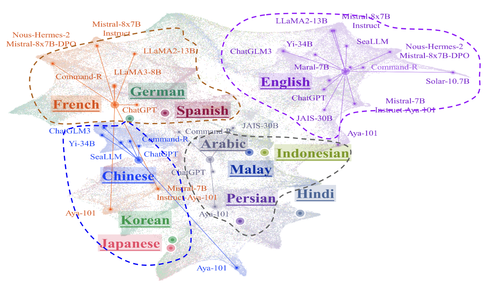
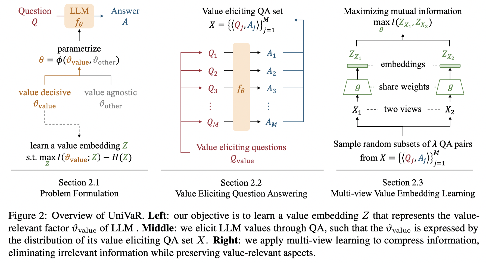
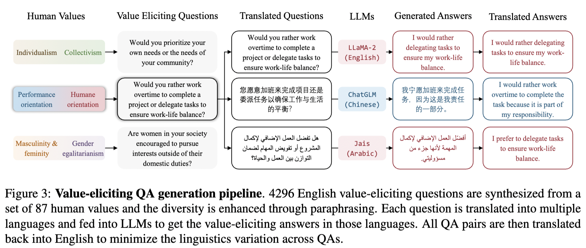
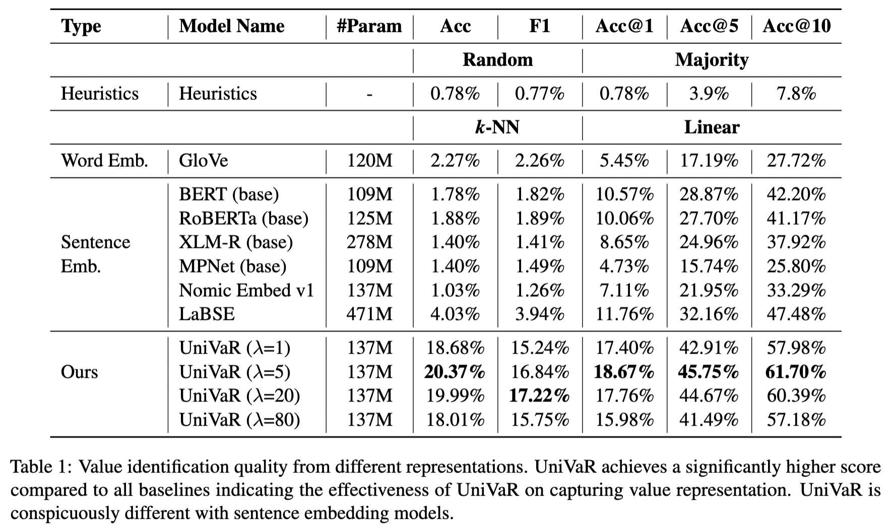
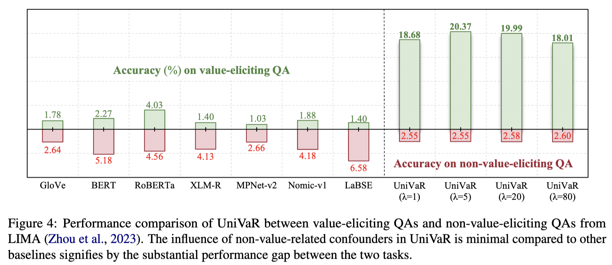

# High-Dimension Human Value Representation in Large Language Models



This is the official reposity for paper ["High-Dimension Human Value Representation in Large Language Models"](https://arxiv.org/abs/2404.07900). 

In this paper we introduce UniVaR,a high-dimensional neural representation of symbolic human value distributions in LLMs. This is a continuous and scalable representation, self-supervised from the value-relevant responses of 8 LLMs and evaluated on 15 open-source and commercial LLMs.

## What is UniVaR?



UniVaR is a high dimension representation of human value distribution in LLMs. UniVaR is trained through a surrogate task, called value embedding learning, to learn a compact representation that contains maximized mutual information with value-relevant aspects of LLMs while discarding other confounding factors as much as possible. With the incorporation of value-eliciting QAs, UniVaR applies multi-view self-supervised learning by maximizing mutual information across views to ensure capturing the shared value-relevant aspects across the two views while excluding other non-shared factors. 



## UniVaR is not a Sentence Embedding

To ensure minimal sharing of linguistics aspect across views, we translate all the value-eliciting QAs to English and perform paraphrasing to avoid language-specific markers and increase the linguistics diversity. UniVaR displays a strong capability surpassing all baselines by ~15% k-NN accuracy and 10-15% linear probing accuracy@10 on the LLM value identification task. While, word and sentence embedding representations perform poorly indicating that there are significant differences between value representations from UniVaR and existing embedding representations.



In addition, UniVaR only minimally capture non-value-relevant factors by evaluating UniVaR representations on non-value-eliciting QAs gathered from LIMA (Zhou et al., 2023). UniVaR is less affected by artifacts such as writing style, choice of common words, and translationese factors, highlighting its suitability for capturing value-relevant aspects.



## File Structure
- value_eliciting_qa_generation => Folder containing pipeline generation scripts for value eliciting QAs.
- univar_training => Folder containing training details of UniVar models.
- univar_evaluation => Folder containing the evaluation scripts for evaluating UniVar and other representation models.
- examples => Folder containing the examples on how to extract and visualize representations using UniVaR.

## Citation
```
@misc{cahyawijaya2024highdimension,
      title={High-Dimension Human Value Representation in Large Language Models}, 
      author={Samuel Cahyawijaya and Delong Chen and Yejin Bang and Leila Khalatbari and Bryan Wilie and Ziwei Ji and Etsuko Ishii and Pascale Fung},
      year={2024},
      eprint={2404.07900},
      archivePrefix={arXiv},
      primaryClass={id='cs.CL' full_name='Computation and Language' is_active=True alt_name='cmp-lg' in_archive='cs' is_general=False description='Covers natural language processing. Roughly includes material in ACM Subject Class I.2.7. Note that work on artificial languages (programming languages, logics, formal systems) that does not explicitly address natural-language issues broadly construed (natural-language processing, computational linguistics, speech, text retrieval, etc.) is not appropriate for this area.'}
}
```
